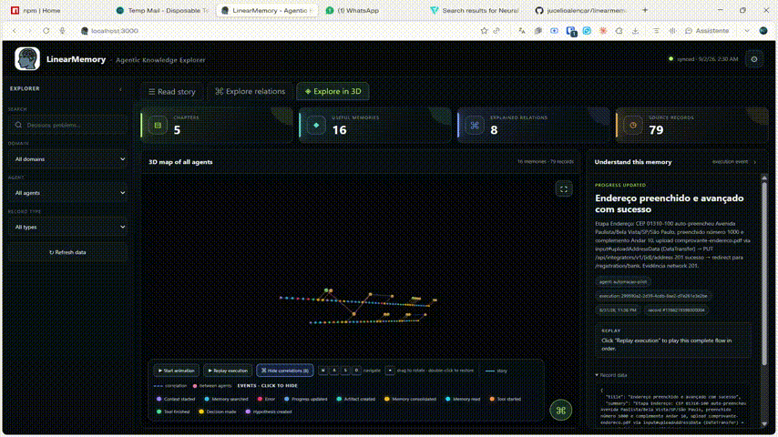
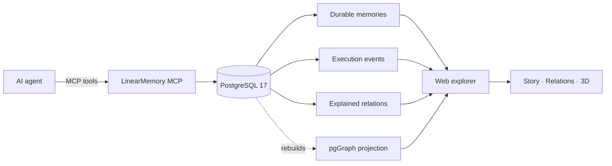

<div align="center">
  
  <h1>LinearMemory</h1>
  <p><strong>Agentic Knowledge Explorer</strong></p>
  <p>Durable, observable, and human-readable memory for AI agents.</p>

  <p>
    <a href="https://github.com/jucelioalencar/linearmemory/actions/workflows/release.yml"></a>
    <a href="https://github.com/jucelioalencar/linearmemory/releases"></a>
    <a href="https://hub.docker.com/r/jucelioalencar/linearmemory"></a>
    <a href="LICENSE"></a>
    
    
    
    
  </p>

  <p>
    <a href="https://trendshift.io/repositories/213782?utm_source=repository-badge&amp;utm_medium=badge&amp;utm_campaign=badge-repository-213782" target="_blank" rel="noopener noreferrer"></a>
  </p>
</div>

[](https://snyk.io/test/github/jucelioalencar/linearmemory?targetFile=apps/mcp/package.json)

## LinearMemory in action

Explore agent histories, consolidated knowledge, execution replays, and cross-agent relationships in the interactive web interface.

<p align="center">
  
</p>

## Make agent memory understandable

LinearMemory is a persistent memory system for AI agents. It records observable execution events, consolidates validated knowledge, and connects related memories without turning an agent's internal reasoning into an opaque transcript.

Agents access memory through a self-describing MCP server. Humans explore the same knowledge as a chronological story, a relationship map, or an interactive 3D graph.

### Key features

- **Human-readable history** — follow agent activity as a chronological sequence of small, observable events.
- **Durable knowledge** — consolidate only validated facts, decisions, procedures, artifacts, and outcomes.
- **Multi-agent memory** — keep each agent identifiable while connecting knowledge across agents and workspaces.
- **Explained relationships** — every graph edge has a direction, relation type, evidence, confidence, and human-readable explanation.
- **Interactive 3D explorer** — inspect timelines, replay executions, focus filters, hide event types, and navigate correlations.
- **Knowledge hierarchy** — organize long-lived domains above workspaces, sessions, and individual executions.
- **MCP-native protocol** — tools tell the LLM what to send, when to search, and what must never be persisted.
- **Auditable storage** — PostgreSQL remains authoritative; the pgGraph projection is derived and rebuildable.
- **Local-first deployment** — run the database, MCP server, and web explorer with Docker Compose.

## How it works



LinearMemory separates four kinds of information:

1. **Context** identifies the agent, domain, workspace, session, execution, goal, and original user request.
2. **Events** describe observable actions such as memory reads, tool calls, decisions, errors, and corrections.
3. **Reflections** capture process learning without presenting it as factual knowledge.
4. **Memories** contain validated, reusable knowledge explicitly consolidated when an execution finishes.

## Example use cases

| Use case | What LinearMemory provides |
| --- | --- |
| Long-running coding agents | Decisions, architecture, failures, corrections, and reusable procedures across sessions. |
| Multi-agent systems | Shared domain knowledge with agent identity and explicit cross-agent relationships. |
| Support and operations | Auditable incident histories, evidence, outcomes, and validated runbooks. |
| Research workflows | Traceable hypotheses, sources, conclusions, and links between related findings. |
| Agent evaluation | Observable execution timelines without storing private chain-of-thought. |

## Quick start with Docker Hub

### Prerequisites

- Docker Desktop with Docker Compose
- Git
- Ports `3000`, `3333`, and `5432` available, or custom port environment variables

### Windows PowerShell

```powershell
git clone https://github.com/jucelioalencar/linearmemory.git
Set-Location linearmemory

New-Item -ItemType Directory -Force .secrets | Out-Null
'replace-with-a-local-password' | Set-Content -NoNewline .secrets/postgres_password

docker compose -f compose.yaml -f compose.dockerhub.yaml config
docker compose -f compose.yaml -f compose.dockerhub.yaml pull
docker compose -f compose.yaml -f compose.dockerhub.yaml up --no-build -d
```

### Linux and macOS

```bash
git clone https://github.com/jucelioalencar/linearmemory.git
cd linearmemory

mkdir -p .secrets
printf '%s' 'replace-with-a-local-password' > .secrets/postgres_password

docker compose -f compose.yaml -f compose.dockerhub.yaml config
docker compose -f compose.yaml -f compose.dockerhub.yaml pull
docker compose -f compose.yaml -f compose.dockerhub.yaml up --no-build -d
```

This installation pulls the prebuilt `mcp-latest`, `web-latest`, and `postgres-latest` images from [Docker Hub](https://hub.docker.com/r/jucelioalencar/linearmemory). Images are published for `linux/amd64` and `linux/arm64` with max-level SLSA provenance and an SPDX SBOM attestation.

To pin every service to a released version, set `LINEARMEMORY_DOCKER_TAG` before running Compose. Do not include the service prefix in this value:

```powershell
$env:LINEARMEMORY_DOCKER_TAG = '0.2.43'
docker compose -f compose.yaml -f compose.dockerhub.yaml pull
docker compose -f compose.yaml -f compose.dockerhub.yaml up --no-build -d
```

To build the images from the checked-out source instead, use:

```bash
docker compose up --build -d
```

When all containers are healthy, open the explorer at [http://localhost:3000](http://localhost:3000).

| Service | Address | Purpose |
| --- | --- | --- |
| Web explorer | `http://localhost:3000` | Story, relation, and 3D memory exploration |
| MCP server | `http://localhost:3333/mcp` | Streamable HTTP endpoint for agents |
| MCP health | `http://localhost:3333/health` | Service health check |
| PostgreSQL | `localhost:5432` | Authoritative persistence and graph projection |

Ports can be changed with `WEB_PORT`, `MCP_PORT`, and `POSTGRES_PORT`. Services bind to `127.0.0.1` by default; set `BIND_ADDRESS` only when you intentionally need another interface.

### Optional semantic memory

Lexical search works without an external service. Open **Settings → Semantic memory** to choose OpenAI, Azure OpenAI, Ollama, or another OpenAI-compatible provider. Configure its endpoint, model, and optional API credential, then enable semantic search. Provider settings are stored in PostgreSQL and credentials are encrypted before storage using the Docker secret. The API never returns the credential.

The Docker stack includes a private Ollama service and offers two one-click local models. No model weights are downloaded during normal startup; choose **Ollama**, select a model, and click **Download selected model**:

| Local model | Download | Practical requirement | Best fit |
| --- | ---: | --- | --- |
| `qwen3-embedding:4b` | about 2.5 GB | 16 GB system RAM; approximately 4–7 GB while active | Recommended balance for CPU-only computers |
| `qwen3-embedding:8b-q4_K_M` | about 4.7 GB | approximately 8–12 GB while active; 24 GB RAM or a compatible GPU recommended | Better quality, but significantly slower and heavier |

These RAM figures are practical estimates rather than hard limits. The 8B model can run on some 16 GB systems, but other memory-heavy applications should be closed and CPU generation may be slow. The Ollama container image also requires several gigabytes of disk space. Downloaded weights persist in the `linearmemory-ollama-data` Docker volume.

When semantic search is enabled, LinearMemory automatically generates embeddings for existing memories in the background. The same settings page shows progress and can retry missing embeddings. Provider failures never disable lexical search. The current database vector size is 1536 dimensions, so the selected model must return exactly 1536 values.

Environment variables `EMBEDDING_ENDPOINT`, `EMBEDDING_API_KEY`, and `EMBEDDING_MODEL` remain supported as deployment-level fallbacks, but the web configuration takes precedence.

### Backup and restore

Open **Settings → Backup & restore** to download a complete JSON backup of the authoritative `memory` tables. Restore validates the LinearMemory backup format and requires explicit confirmation before atomically replacing the current data. The graph projection is rebuilt after a successful restore.

Encrypted provider credentials are included only as encrypted data. Restoring them to an installation that uses a different encryption secret requires entering the credential again.

## MCP memory protocol

The recommended lifecycle prevents duplicate workspaces and keeps durable memory clean:

```text
find_domain → create_domain (only if needed)
           → find_workspace → suggest_workspace → create_workspace (only if needed)
           → begin_context → search_memory
           → add_execution_event ...
           → find_memory_relations → link_memories (when justified)
           → record_reflection → complete_execution
```

Every tool input is documented in its JSON Schema so an LLM can determine what belongs in each field. If `agentId` is omitted, LinearMemory uses `agent_default`.

### Tools

| Tool | Purpose |
| --- | --- |
| `find_domain` | Find a stable knowledge domain before creating one. |
| `create_domain` | Create a durable domain only when no suitable candidate exists. |
| `update_domain` | Intentionally update a domain with an auditable reason. |
| `find_workspace` | Reuse an existing project or work stream inside a domain. |
| `suggest_workspace` | Propose a normalized workspace without writing data. |
| `create_workspace` | Create a workspace after search and validation. |
| `update_workspace` | Intentionally update a workspace without changing its identity or domain. |
| `begin_context` | Start an observable execution with identity, goal, request, and environment. |
| `search_memory` | Retrieve durable facts and decisions relevant to the current work. |
| `add_execution_event` | Append a small, observable event without private reasoning. |
| `find_memory_relations` | Inspect current edges and discover candidate memories without creating relations. |
| `link_memories` | Create or update one explicit, evidence-backed directed relationship. |
| `unlink_memories` | Remove an incorrect or obsolete relationship and record why. |
| `resolve_memory_conflict` | Resolve or dismiss a detected contradiction with evidence. |
| `record_reflection` | Store process learning separately from durable facts. |
| `search_reflections` | Retrieve process learning without treating it as durable fact. |
| `complete_execution` | Finish the execution and apply explicit, validated memory changes. |

### Execution events

`ContextStarted`, `MemorySearched`, `MemoryRead`, `MemoryLinked`, `MemoryUnlinked`, `ToolStarted`, `ToolFinished`, `HypothesisCreated`, `DecisionMade`, `ArtifactCreated`, `ProgressUpdated`, `ErrorOccurred`, `CorrectionMade`, `UserFeedbackReceived`, `MemoryConsolidated`, `ReflectionRecorded`, and `ExecutionCompleted`.

### Memory relationships

`supports`, `depends_on`, `caused`, `contradicts`, `refines`, `implements`, `validates`, `supersedes`, and `related_to`.

> [!IMPORTANT]
> Text similarity is a discovery hint, not a relationship. Before calling `link_memories`, the agent must read both memories and provide direction, explanation, evidence, and confidence.

> [!NOTE]
> Reflections are excluded from `search_memory`. Retrieve them with `search_reflections`; after independent validation, a later execution can consolidate knowledge with `validatedFromReflectionId` provenance.

## Agent templates

The [`agents/`](agents/) directory provides an English `automation-pilot` agent pack for OpenCode, Claude Code, OpenAI Codex, Gemini CLI, Cursor, and generic LLM clients. Every platform variant follows one shared browser-automation and LinearMemory behavior contract, with native metadata for its target client.

See [`agents/README.md`](agents/README.md) for supported formats and installation paths.

## Web explorer

The browser interface presents the same source data through three complementary views:

- **Read story** — a chronological, human-readable memory narrative with date, time, agent, and execution context.
- **Explore relations** — focused cause, dependency, support, validation, and contradiction paths.
- **Explore in 3D** — an interactive multi-agent graph with configurable grouping, elevated correlation waves, local or global relation focus, connection replay, event colors, execution replay, filters, fullscreen mode, keyboard navigation, and contextual tooltips.

The interface defaults to English and supports Spanish and Portuguese. Dark and white themes are available from Settings.

## Architecture

| Component | Technology | Responsibility |
| --- | --- | --- |
| `apps/mcp` | TypeScript, Express, MCP SDK, Zod | Modular database, catalog, session, event, embedding, migration, and protocol services |
| `apps/web` | HTML, CSS, JavaScript, Nginx, 3D Force Graph | Human-readable and interactive exploration |
| `docker/postgres` | PostgreSQL 17, pgGraph 1.2.0, pgvector 0.8.6, pg_cron | Authoritative storage, graph projection, and database jobs |
| `compose.yaml` | Docker Compose | One local application network and reproducible startup |

```text
linearmemory/
├── apps/
│   ├── mcp/                 # MCP server, services, migrations, and tests
│   └── web/                 # Agentic Knowledge Explorer
├── docker/
│   ├── compose/             # Application and database services
│   └── postgres/            # PostgreSQL image and schema initialization
├── compose.yaml
├── Makefile
└── README.md
```

## Verification and testing

Check that all services are healthy:

```bash
docker compose ps
```

Verify PostgreSQL extensions and the graph projection:

```bash
docker compose exec postgres psql -U linearmemory -d linearmemory \
  -c "SELECT extname, extversion FROM pg_extension WHERE extname IN ('graph', 'vector', 'pg_cron');"

docker compose exec postgres psql -U linearmemory -d linearmemory \
  -c "SELECT * FROM graph.status();"
```

Type-check and test the MCP server from a development environment with PostgreSQL running:

```bash
cd apps/mcp
npm ci
npm run typecheck
npm run build
npm run migrate:dev
npm test
```

### Performance telemetry

Every MCP tool call emits one structured JSON performance log with the operation, category, duration, HTTP status, timestamp, and slow-request flag. `search_memory` also reports separate embedding, database, and total durations so local-model startup can be distinguished from database latency.

View the retained in-memory percentiles at:

```text
GET http://localhost:3333/api/performance
```

Run the non-destructive MCP benchmark against the workspace with the most active memories. It measures 50 event ingestions and 30 searches, then removes its temporary execution:

```bash
cd apps/mcp
npm run benchmark:performance -- --event-iterations=50 --search-iterations=30
```

Use `PERFORMANCE_SLOW_REQUEST_MS` to configure the warning threshold, `PERFORMANCE_LOG_CAPACITY` to configure retained samples, and `EMBEDDING_CACHE_SIZE` to configure the in-process semantic-query cache.

### Isolated integration tests

The integration suite uses Testcontainers to start the real LinearMemory PostgreSQL image with pgGraph, pgvector, pg_cron, pg_trgm, and unaccent. It applies every migration, runs database and concurrency tests, validates backup/restore and embedding caching, reports coverage, and removes the temporary database automatically. Your local LinearMemory database is never used.

With Docker running:

```bash
cd apps/mcp
npm run test:integration
```

Set `TESTCONTAINERS_POSTGRES_IMAGE` to use an image that is already built instead of building the PostgreSQL Dockerfile. Pull requests run the same isolated suite in GitHub Actions. Coverage gates require at least 75% lines, 60% branches, and 70% functions.

MCP dependencies are also checked by Snyk on pull requests and pushes. High- and critical-severity findings fail the security job. See the current [Snyk dependency report](https://snyk.io/test/github/jucelioalencar/linearmemory?targetFile=apps/mcp/package.json).

Useful Make targets are also available:

```bash
make up
make ps
make logs
make graph-status
make down
```

## Resetting local data

Schema migrations run automatically whenever the MCP container starts. To intentionally erase all local LinearMemory data and rebuild the stack:

```bash
docker compose down -v --remove-orphans
docker compose up --build -d
```

> [!CAUTION]
> This permanently removes the local `linearmemory-postgres-data` volume and every stored domain, workspace, execution, event, memory, and relationship.

## Security model

LinearMemory is designed for trusted local development. It does not currently implement user authentication or authorization. Docker ports bind to `127.0.0.1` by default so the web explorer, MCP endpoint, and PostgreSQL are not intentionally exposed to the local network. Do not set `BIND_ADDRESS=0.0.0.0`, publish the services through a proxy, or deploy them on a shared network without adding authentication, TLS, network policy, and database access controls.

## Contributing

Contributions, bug reports, and design discussions are welcome. Before opening a pull request:

1. Keep memory events observable and free of private chain-of-thought.
2. Preserve PostgreSQL as the source of truth and graph projections as rebuildable views.
3. Add self-describing schemas when changing MCP tools.
4. Run the verification commands above.

Use [GitHub Issues](https://github.com/jucelioalencar/linearmemory/issues) for questions, proposals, and bug reports.

## License

LinearMemory is available under the [MIT License](LICENSE).
